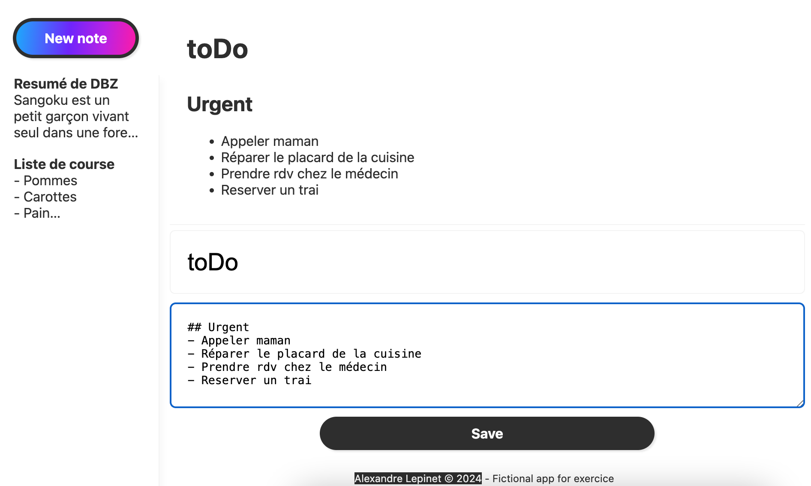

# Le projet : Markdown Bloc note
**#React #Javascript #Scss #showdown
## Instructions
- Créer un bloc-notes. 

- Dans celui-ci, on pourra écrire en markdown, et le texte sera affiché en live sous forme de HTML.

- L'ensemble des notes sera stocké dans le localStorage.

- l'application sera constituée de plusieurs parties :  

    Sur la gauche, l'utilisateur aura accès à une barre de navigation. Celle-ci contiendra la liste de tes notes. L'utilisateur pourra y voir un titre et le début du texte (~15 mots). L'utilisateur peut créer une nouvelle note en cliquant sur le bouton du haut.À droite, prenant ~80% de la largeur, l'utilisateur verra le contenu de la note sélectionnée, bien mis en forme en HTML, dans la partie haute.

    Dans la partie basse, un champ de texte (input) permettant de définir le nom de la note, ainsi qu'un autre champ (textarea) permettant de modifier le contenu de la note en markdown.

    En cliquant sur "save", l'utilisateur sauvegarde la note. C'est-à-dire que s'il recharge la page, sa note est toujours visible dans la liste à gauche. Il faudra donc sauvegarder les notes dans le localStorage.
## User stories
- L'utilisateur peut ajouter une note.
- L'utilisateur peut modifier une note.
- L'utilisateur peut consulter une note.
- L'utilisateur peut basculer entre les notes pour voir celle qui lui plaît.