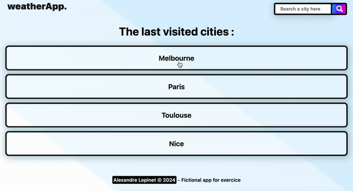

 

# Le projet : Weather app
**#React #Javascript #Scss #OpenWeatherApi #GeoDbCitiesApi**
## Instructions
- Créer une app météo

- Pour récupérer toutes les informations nécessaires, tu utiliseras l'API "Open Weather Map". Tu pourras trouver toutes les informations nécessaires sur la doc de l'API.

- Lorsque l'utilisateur arrive sur l'application, il ne voit qu'un header, composé d'une barre de recherche et d'un titre de l'application. Si des recherches ont été faites dans le passé, l'utilisateur voit une liste de 5 liens, lui proposant de regarder les 5 dernières villes consultées par lui-même #localStorage.

- L'application, pour commencer, aura dans son header, une barre de recherche. Dans celle-ci, l'utilisateur pourra rechercher une ville. L'application lui proposera des villes, à partir de 3 lettres rentrées.

- Si l'utilisateur clique sur une de ces propositions, il arrivera sur une page City, correspondant à la ville cliquée. L'URL changera en conséquence, sous ce template: www.mondomaine.fr/city/idcity.

- Il pourra alors voir le nom de la ville, et la météo sur les 5 jours à venir. Chaque jour de météo sera également un lien vers la page Forecast. Pour chaque jour on y trouvera quelques informations météo.

- Au clic sur un jour de météo, l'utilisateur arrivera sur une page Forecast, où il verra la liste des prévisions horaires du jour sélectionné, ainsi que la date du jour et la ville concernée.

- L'URL sera composée comme ceci: www.mondomaine.fr/forecast/idforecast.

- Le rendu attendu est une application React. L'utilisateur pourra aller sur 3 pages: Home, City et Forecast.

- Pour rechercher une ville, une barre de recherche avec autocomplete est disponible.

- Dès qu'un utilisateur va sur une page ville, la ville est sauvegardée dans le localStorage.

- Sur la Home, l'utilisateur voit les 5 dernières villes consultées. Il peut cliquer dessus pour accéder à la ville et ses informations météorologiques.
